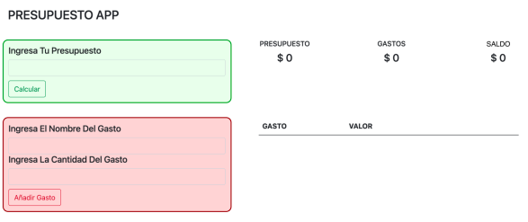

# APP DE PRESUPUESTO

EJERCICIO:
Pondrás a prueba todas tus habilidades de JavaScript, creando una aplicación de presupuesto llamada:
"Presupuesto App". El objetivo de este programa es ayudar a tus usuarios a administrar sus finanzas, de
una forma que sea sencilla de visualizar. 

